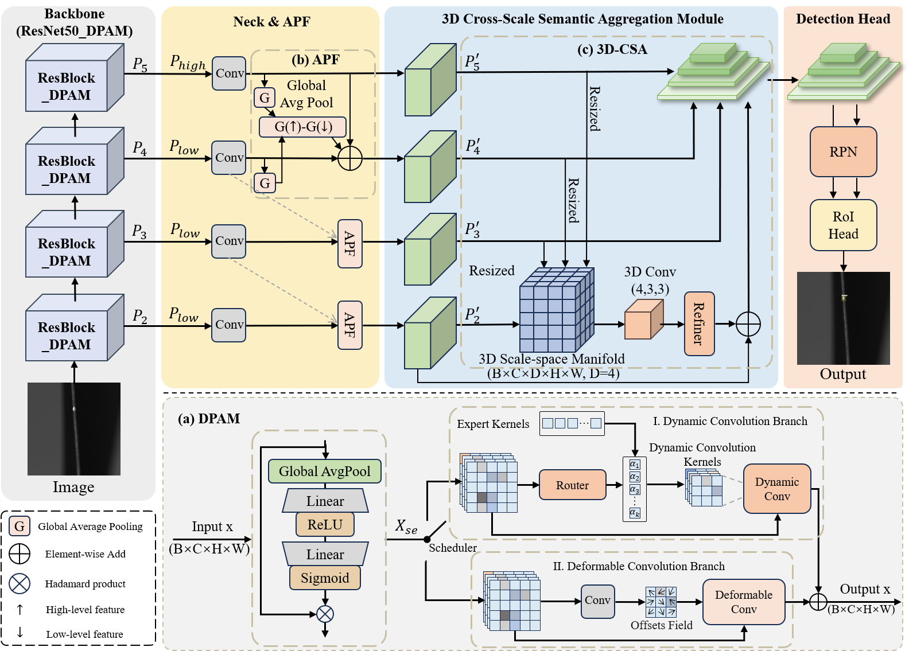

# Micro Surface Defect Inspection of Aero-Engine Blades via Dynamic Cross-Scale Semantic Aggregation (DCSA-Net)

Official PyTorch implementation of the paper: **"Micro Surface Defect Inspection of Aero-Engine Blades via Dynamic Cross-Scale Semantic Aggregation"**, accepted by **IEEE Transactions on Industrial Informatics (TII)**.

---


---

## 🚩 News
- [2026/04/14] 🌟 The source codes have been released.
- [2026/04/02] 🎉 Our article is accepted by *IEEE Transactions on Industrial Informatics (TII)*.

## 🚀 Overview
  

This repository contains the official code for DCSA-Net, a specialized framework designed for micro-surface defect inspection under complex industrial environments.

## 🛠️ Installation

1. Clone the repository:
```bash
git clone https://github.com/jinxsd/dcsanet.git
cd dcsanet
```

2. Install dependencies:
```bash
pip install -r requirements.txt
```

## 📊 Dataset Preparation

Organize your dataset in COCO format as follows:

```text
datasets/
└── coco/
    ├── annotations/
    │   ├── train.json
    │   └── val.json
    ├── train/
    └── val/
```

## 🏋️ Training and Evaluation

### Training
To train the DCSA-Net from scratch (distributed training via `accelerate`):
```bash
NCCL_P2P_DISABLE=1 NCCL_IB_DISABLE=1 CUDA_VISIBLE_DEVICES=0 accelerate launch main.py --mixed-precision fp16 --seed 42
```

### Evaluation
To evaluate the model with a pre-trained checkpoint:
```bash
NCCL_P2P_DISABLE=1 NCCL_IB_DISABLE=1 CUDA_VISIBLE_DEVICES=1 accelerate launch test.py \
  --coco-path ./datasets/coco \
  --model-config configs/networks/proposed.py \
  --checkpoint ./checkpoints/dcsanet_resnet50.pth
```
> *Note: Please replace the paths above with your actual local directories.*

## 📄 Citation

If you find our work useful, please cite:
```bibtex
@article{li2026micro,
  title={Micro Surface Defect Inspection of Aero-Engine Blades via Dynamic Cross-Scale Semantic Aggregation},
  author={Li, Kaijie and Jiang, Shuai and Lin, Yao and Zhou, Jingyu and Qu, Hao and Meng, Xiangfei and Wang, Yaonan and Liu, Min},
  journal={IEEE Transactions on Industrial Informatics},
  year={2026},
  publisher={IEEE}
}
```
